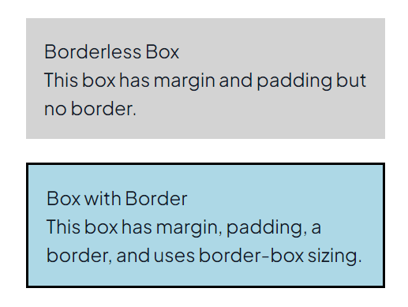

📈 What You Will Learn:
Before starting this task, watch the CSS Box Model Part 1 & Part 2 video to understand the core concepts.

https://www.loom.com/share/c66f8f6e02774e35aafa3c04cb01b15d?sid=bf62e0ae-e231-453d-b3fd-ae9067a07a5c

https://www.loom.com/share/dc92b61658e84cd79dee6ff33510a1a2?sid=0a90fba5-3145-4a85-8b5a-78c9fa3bd6a7

(You can skip the videos if you have watched it already)


You will focus on the following CSS Box Model properties:

```
    Margin → Controls the space outside the element.
    Padding → Controls the space inside the element, between content and border.
    Border → Defines the outer boundary of an element.
    Content → The actual content inside an element.
    Box-Sizing → Determines how width and height are calculated (content-box vs. border-box).
    Margin Collapse → Understand how adjacent margins interact.
```

📝 Deliverables:
```md
Your task is to apply the following CSS styles based on the concepts described below.

1. Create Two Boxes:
Box 1 (.box-1):
Should have margin and padding.
No border should be applied.
Background color: light gray.
Box 2 (.box-2):
Should have margin and padding.
Border: 2px solid black.
Box-Sizing: border-box.
Background color: light blue.
2. Apply Margin and Padding:
Both boxes should have margin: 20px; and padding: 15px;.
3. Apply Border and Box-Sizing:
Only Box 2 should have a border (2px solid black).
Box 2 should use box-sizing: border-box; to control width and height calculations.
```

📚 Instructions:

    Remove any comments and add the styles exactly as described.
    Use the correct selectors (.box-1, .box-2).
    Focus only on writing correct CSS rules in your compiler.


Your final output should demonstrate proper application of margin, padding, border, content, box-sizing, and margin collapse.

This is the desired result:




```css
.box-1{
    margin: 20px;
    padding: 15px;
    background-color: lightgray;
}

.box-2{
    margin: 20px;
    padding: 15px;
    border: 2px solid black;
    background-color: lightblue;
    box-sizing: border-box;
}
```