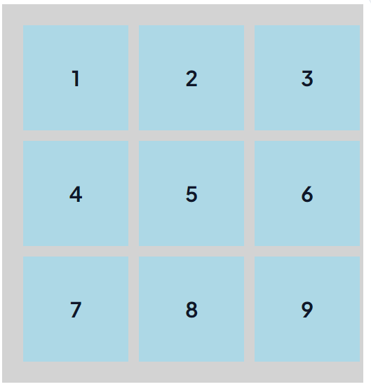

What You Will Learn:


Before starting this task, review the key concepts of CSS Grid to understand how elements align and distribute space within a grid layout.

(You can skip this step if you are already familiar with CSS Grid.)

You will focus on the following CSS Grid properties:

```md
display: grid → Defines a grid container.
grid-template-columns → Defines the number and size of columns.
grid-template-rows → Defines the number and size of rows.
gap → Controls the spacing between rows and columns.
justify-items → Aligns grid items along the inline axis.
align-items → Aligns grid items along the block axis.
place-items → A shorthand for justify-items and align-items.
grid-column → Controls how many columns an item spans.
grid-row → Controls how many rows an item spans.
```

Deliverables:
```md
Your task is to apply the following CSS styles based on the concepts described below.


1. Create a Grid Layout:
Container (.grid-container):Should have display: grid.

grid-template-columns: repeat(3, 100px); (Creates 3 equal columns).
grid-template-rows: repeat(3, 100px); (Creates 3 equal rows).
gap: 10px; (Adds spacing between the grid items in both rows and columns).
Background color: light gray.
Padding: 20px.


Grid Items (.grid-item):

Center both the grid item itself and the content inside it (you can use flex for this).
Add a lightblue background color.
Font-size should 20px and bold . 


2. Apply Grid Properties:
The .grid-container should properly distribute 9 boxes within a 3x3 layout.
Ensure that the gap property applies spacing in both rows and columns.
Each .grid-item should have proper alignment and visibility.
```


Your ouput should look like this one :



```css
.grid-container{
    display: grid;
    grid-template-columns: repeat(3, 100px);
    grid-template-rows: repeat(3, 100px);
    gap: 10px;
    background-color: lightgray;
    padding: 20px;
}

.grid-item{
    display: flex;
    justify-content: center;
    align-items: center;
    background-color: lightblue;
    font-size: 20px;
    font-weight: bold;
}
```