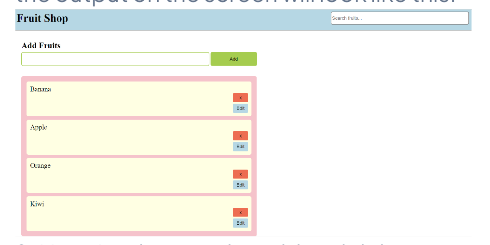

# Add & Delete Fruits

## Watch this video to understand event listeners:

Event Listeners https://drive.google.com/file/d/1AgInQcp0Q4Bs9PLelX6KnIzzEZ1k3io5/view?usp=drive_link

Watch this video to understand how to add and delete items from a list:

https://drive.google.com/file/d/1PPs74q5VbTXPSn0FQozAp5Bc0cV4wHct/view?usp=drive_link

Add and Delete Fruits

## Deliverables:

1. In each "li" after the delete button add an edit button with class 'edit-btn'. Once you do this the output on the screen will look like this:

2. Now, implement the add and delete functionality just the way it is done in the video. There is only one difference that now the new 'li' element that you will create will have two buttons (delete and edit) instead of one button.

## Note:

    You have to just add the edit button. You do not have to implement the edit functionality.
    Do not touch the html file.
    To listen for form submission event use addEventListener.

Push the code to GitHub.